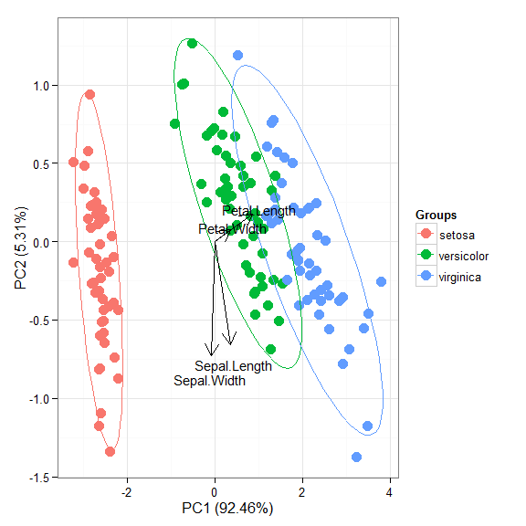
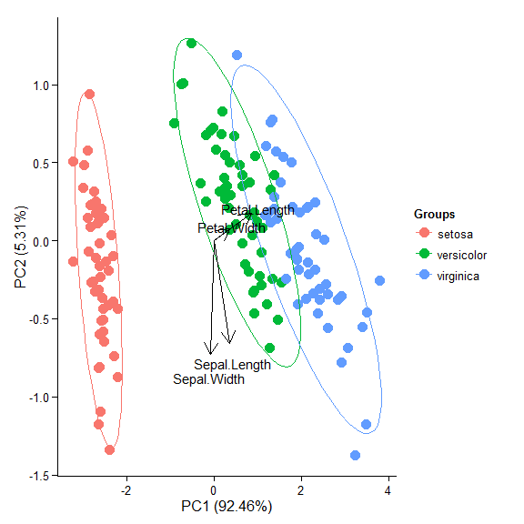
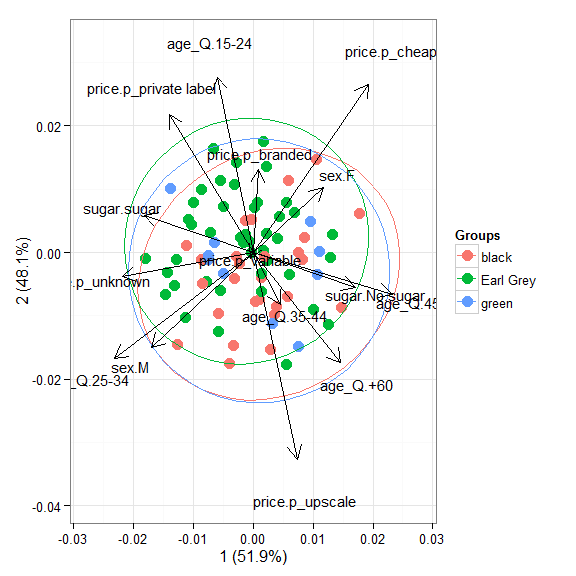
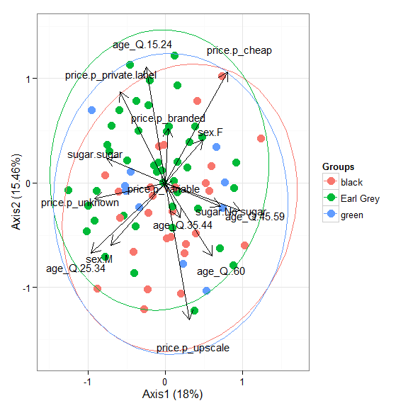
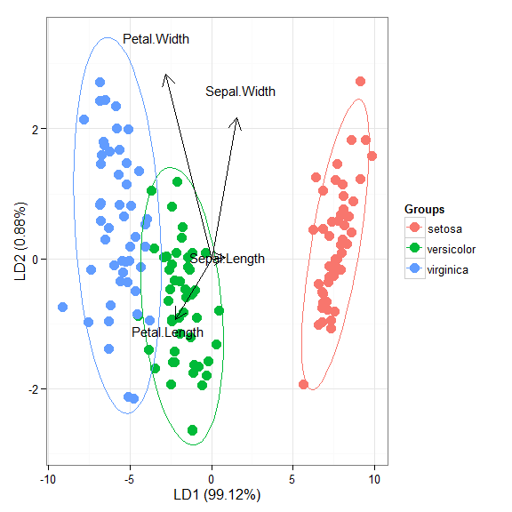
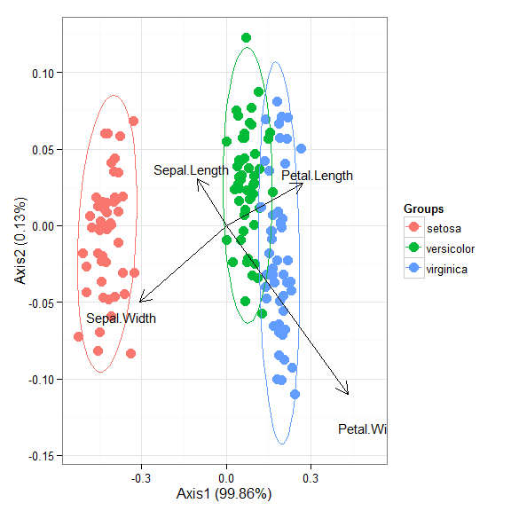
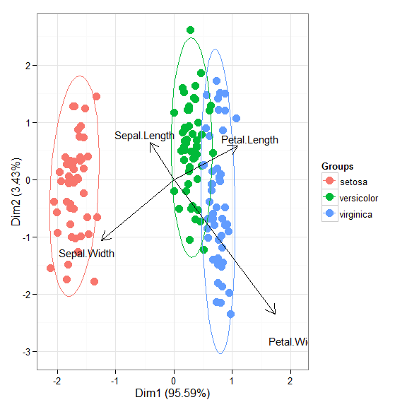

I'll be the first to admit that the topic of plotting ordination results using ggplot2 has been visited many times over.  As is my typical fashion, I started creating a [package](https://github.com/fawda123/ggord) for this purpose without completely searching for existing solutions.  Specifically, the [ggbiplot](https://github.com/vqv/ggbiplot) and [factoextra](https://github.com/kassambara/factoextra) packages already provide almost complete coverage of plotting results from multivariate and ordination analyses in R.  Being the stubborn individual, I couldn't give up on my own package so I started exploring ways to improve some of the functionality of biplot methods in these existing packages.  For example, ggbiplot and factoextra work almost exclusively with results from principal components analysis, whereas numerous other multivariate analyses can be visualized using the biplot approach.  I started to write methods to create biplots for some of the more common ordination techniques, in addition to all of the functions I could find in R that conduct PCA.  This exercise became very boring very quickly so I stopped adding methods after the first eight or so.  That being said, I present this blog as a sinking ship that was doomed from the beginning, but I'm also hopeful that these functions can be built on by others more ambitious than myself.

The process of adding methods to a default biplot function in ggplot was pretty simple and not the least bit interesting.  The default ggpord biplot function (see [here](https://github.com/fawda123/ggord/blob/master/R/ggord.R)) is very similar to the default biplot function from the stats base package.  Only two inputs are used, the first being a two column matrix of the observation scores for each axis in the biplot and the second being a two column matrix of the variable scores for each axis.  Adding S3 methods to the generic function required extracting the relevant elements from each model object and then passing them to the default function.  Easy as pie but boring as hell.   

I'll repeat myself again.  This package adds nothing new to the functionality already provided by ggbiplot and factoextra.  However, I like to think that I contributed at least a little bit by adding more methods to the biplot function.  On top of that, I'm also naively hopeful that others will be inspired to fork my package and add methods.  [Here](https://github.com/fawda123/ggord/blob/master/R/ggord.R) you can view the raw code for the ggord default function and all methods added to that function.  Adding more methods is straightforward, but I personally don't have any interest in doing this myself.  So who wants to help??     

Visit the package repo [here](https://github.com/fawda123/ggord/) or install the package as follows.

```r
library(devtools)
install_github('fawda123/ggord')
library(ggord)
```

Available methods and examples for each are shown below.  These plots can also be reproduced from the examples in the ggord help file.  

```
##  [1] ggord.acm      ggord.ca       ggord.coa      ggord.default 
##  [5] ggord.lda      ggord.mca      ggord.MCA      ggord.metaMDS 
##  [9] ggord.pca      ggord.PCA      ggord.prcomp   ggord.princomp
```

```r
# principal components analysis with the iris data set
# prcomp
ord <- prcomp(iris[, 1:4])

p <- ggord(ord, iris$Species)
p
```

 

```r
p + scale_colour_manual('Species', values = c('purple', 'orange', 'blue'))
```

 

```r
p + theme_classic()
```

 

```r
p + theme(legend.position = 'top')
```

 

```r
p + scale_x_continuous(limits = c(-2, 2))
```

 

```r
# principal components analysis with the iris dataset
# princomp
ord <- princomp(iris[, 1:4])

ggord(ord, iris$Species)
```

 

```r
# principal components analysis with the iris dataset
# PCA
library(FactoMineR)

ord <- PCA(iris[, 1:4], graph = FALSE)

ggord(ord, iris$Species)
```

 

```r
# principal components analysis with the iris dataset
# dudi.pca
library(ade4)

ord <- dudi.pca(iris[, 1:4], scannf = FALSE, nf = 4)

ggord(ord, iris$Species)
```

 

```r
# multiple correspondence analysis with the tea dataset
# MCA
data(tea)
tea <- tea[, c('Tea', 'sugar', 'price', 'age_Q', 'sex')]

ord <- MCA(tea[, -1], graph = FALSE)

ggord(ord, tea$Tea)
```

 

```r
# multiple correspondence analysis with the tea dataset
# mca
library(MASS)

ord <- mca(tea[, -1])

ggord(ord, tea$Tea)
```

 

```r
# multiple correspondence analysis with the tea dataset
# acm
ord <- dudi.acm(tea[, -1], scannf = FALSE)

ggord(ord, tea$Tea)
```

 

```r
# nonmetric multidimensional scaling with the iris dataset
# metaMDS
library(vegan)
ord <- metaMDS(iris[, 1:4])

ggord(ord, iris$Species)
```

 

```r
# linear discriminant analysis
# example from lda in MASS package
ord <- lda(Species ~ ., iris, prior = rep(1, 3)/3)

ggord(ord, iris$Species)
```

 

```r
# correspondence analysis
# dudi.coa
ord <- dudi.coa(iris[, 1:4], scannf = FALSE, nf = 4)

ggord(ord, iris$Species)
```

 

```r
# correspondence analysis
# ca
library(ca)
ord <- ca(iris[, 1:4])

ggord(ord, iris$Species)
```

 

Cheers, 

Marcus
