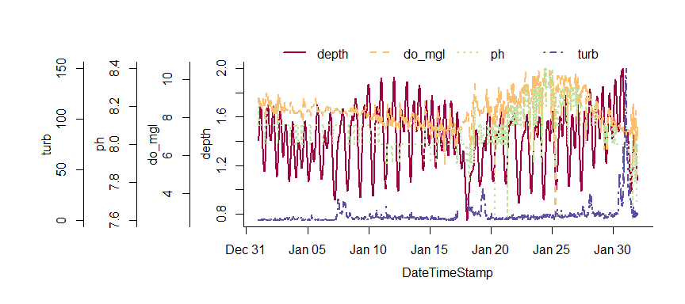

I've just released an updated version of my package for estuary monitoring data, [SWMPr](https://cran.r-project.org/web/packages/SWMPr/index.html), available on CRAN. I've made several additions to the package since it's initial release - nothing too crazy but enough to warrant another push to CRAN and blog post.  I've been pretty bad about regular updates but I've added a few features to make some of the functions easier to use in addition to some new functions for plotting SWMP data.  I'll start with a brief overview of the package then describe some of the major changes since the last release ([2.0.0](https://cran.r-project.org/src/contrib/Archive/SWMPr/)).  As always, please keep a close watch on the [GitHub repository](https://github.com/fawda123/SWMPr) for progress on the development version of the package.

<b>What is SWMPr?</b> SWMPr is an R package for estuary monitoring data from the National Estuarine Research Reserve System (NERRS).  NERRS is a collection of reserve programs located at 28 estuaries in the United States.  The System-Wide Monitoring Program (SWMP) was established by NERRS in 1995 as a long-term monitoring program to collect water quality, nutrient, and weather data at over 140 stations (more info [here](http://www.nerrs.noaa.gov/Default.aspx)). To date, over 58 million records have been collected and are available online through the Centralized Data Management Office ([CDMO](http://cdmo.baruch.sc.edu/)).  The SWMPr package provides a bridge between R and the data provided by SWMP (which explains the super clever name).  The package is meant to augment existing CDMO services and to provide more generic features for working with water quality time series.  The initial release included functions to import SWMP data from the CDMO directly into R, functions for data organization, and some basic analysis functions.  The original release also included functions for estimating rates of ecosystem primary production using the open-water method.  


```r
# installing and loading the package
install.packages('SWMPr')
library(SWMPr)
```

<b>What's new in 2.1?</b> A full list of everything that's changed can be viewed [here](https://github.com/fawda123/SWMPr/blob/master/NEWS.md).  Not all these changes are interesting (bugs mostly), but they are worth viewing if you care about the nitty gritty.  The most noteworthy changes include the following.

* The `overplot` function can be used to plot multiple variables with identical scaling on the y-axis.  I think this is generally discouraged under sound plotting theory (see the rants [here](http://stackoverflow.com/questions/3099219/how-to-use-ggplot2-make-plot-with-2-y-axes-one-y-axis-on-the-left-and-another)), but overplotting is an often-requested feature regardless of popular opinion.  I had to use the base graphics to write this function since it's not possible with ggplot.  I actually borrowed most of the code from a colleague at NERRS, shouts to the Grand Bay office.  To illustrate ease of use...


```r
# import data and do some initial clean up
data(apacpwq)
dat <- qaqc(apacpwq)

# a truly heinous plot
overplot(dat, select = c('depth', 'do_mgl', 'ph', 'turb'),
  subset = c('2013-01-01 0:0', '2013-02-01 0:0'), lwd = 2)
```

 

* The `qaqc` function now has more flexible filtering of QAQC data flags by using regular expression matching, rather than searching by integer flags as in the previous version.  What this means is that observations can be filtered with greater control over what flags and errors are removed.  This example shows how to remove flags using the old method as integer flags and using the new method.  The second example will keep all flags that are annotated with the 'CSM' comment code (meaning check the metadata).  The value with this approach is that not all integer flags are coded the same, i.e., QAQC flags with the same integer may not always have the same error code.  The user may not want to remove all flags of a single type if only certain error codes are important.


```r
# import data
data(apadbwq)
dat <- apadbwq

# retain only '0' and '-1' flags, as in the older version
newdat <- qaqc(dat, qaqc_keep = c('0', '-1'))

# retain observations with the 'CSM' error code
newdat <- qaqc(dat, qaqc_keep = 'CSM')
```

* Several of the data import functions were limited in the total number of records that could be requested from the CDMO.  I made some dirty looping hacks so that most of these rate limitations, although technically still imposed, can be ignored when making large data requests to the CDMO.  Previously, the `single_param`, `all_params`, and `all_params_dtrng` functions were limited to 100 records in a single request - not very useful for time series taken every 15 minutes.  The new version lets you download any number of records using these functions, although be warned that the data request can take a long time for larger requests.  As before, your computer's IP address must be [registered](http://cdmo.baruch.sc.edu/webservices.cfm) with the CDMO to use these functions.

* Although it's now theoretically possible to retrieve all the SWMP data with the above functions, using the `import_local` function is still much, much easier.  The main advantage of this function is that local data can be imported into R, which allows the user to import large amounts of data from a single request. The new release of SWMPr makes this process even easier by allowing data to be imported directly from the compressed, zipped data folder returned from the CDMO data request.  The syntax is the same, but the full path including the .zip file extension must be included.  As before, this function is designed to be used with data from the [zip downloads](http://cdmo.baruch.sc.edu/aqs/zips.cfm) feature of the CDMO.


```r
# this is the path for the downloaded data files, zipped folder
path <- 'C:/this/is/my/data/path.zip'

# import the data
dat <- import_local(path, 'apaebmet')
```

* A nice feature in R documentation that I recently discovered is the ability to search for functions by 'concept' or 'alias' tags.  I've described the functions in SWMPr as being in one of three categories based on their intended use in the data workflow: retrieve, organize, and analyze.  The new version of SWMPr uses these categories as search terms for finding the help files for each function.  The package includes additional functions not in these categories but they are mostly intended as helpers for the primary functions.  As always, consult the [manual](https://cran.r-project.org/web/packages/SWMPr/SWMPr.pdf) for full documentation.


```r
help.search(package = 'SWMPr', 'retrieve')
help.search(package = 'SWMPr', 'organize')
help.search(package = 'SWMPr', 'analyze')
```

* Finally, I've added several default methods to existing SWMPr functions to make them easier to use outside of the normal SWMPr workflow.  For example, combining time series with different time steps is a common challenge prior to data analysis.  The `comb` function achieves this task for SWMP data, although using the previous release of the package on generic data was rather clunky.  The new default method makes it easier to combine data objects with a generic format (data frames), provided a few additional arguments are provided so the function knows how to handle the information.  Default methods were also added for the `setstep`, `decomp`, and `decomp_cj` functions.  

I guarantee there are some bugs in this new release and I gladly welcome bug reports on the [issues](https://github.com/fawda123/SWMPr/issues) tab of the development repo.  Ideas for additional features can also be posted.  Please check out our [SWMPrats](http://swmprats.net/) web page for other SWMP-related analysis tools. 

Cheers, 

Marcus
